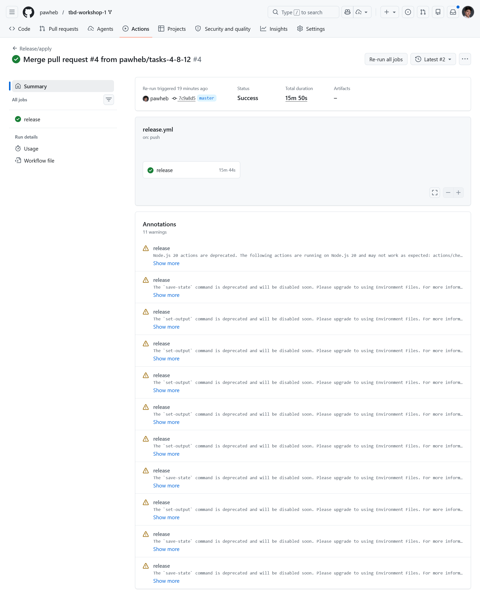
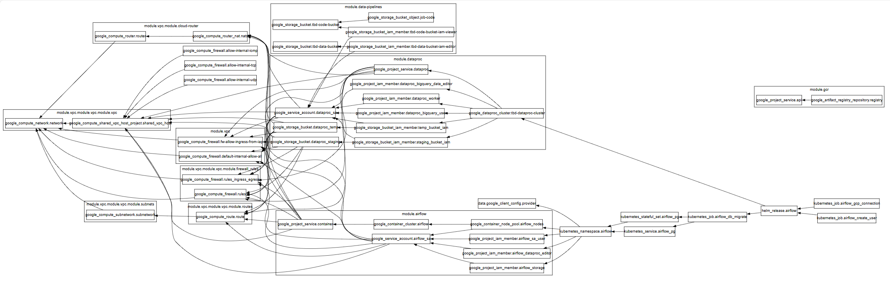
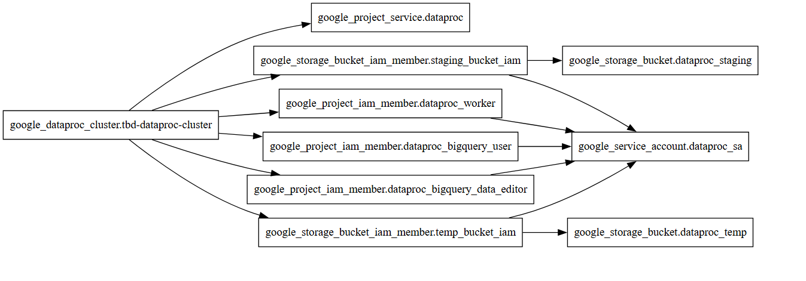
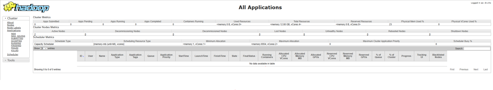
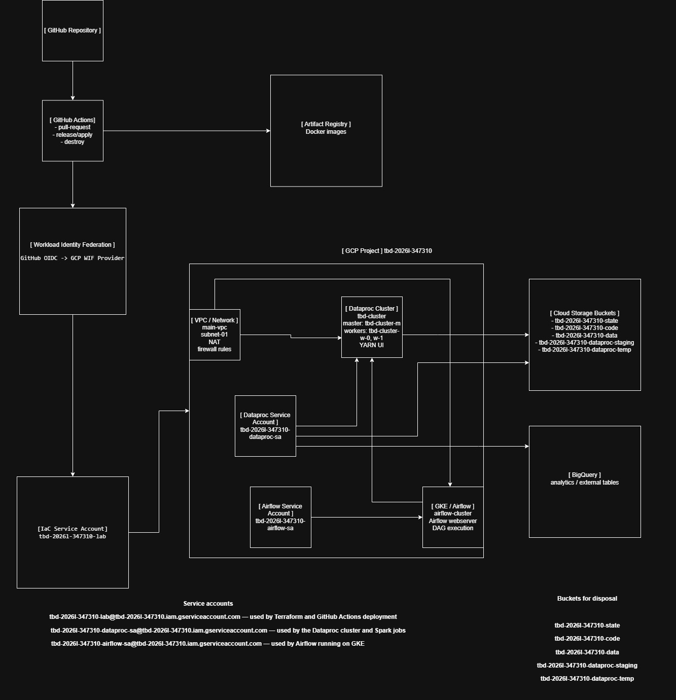
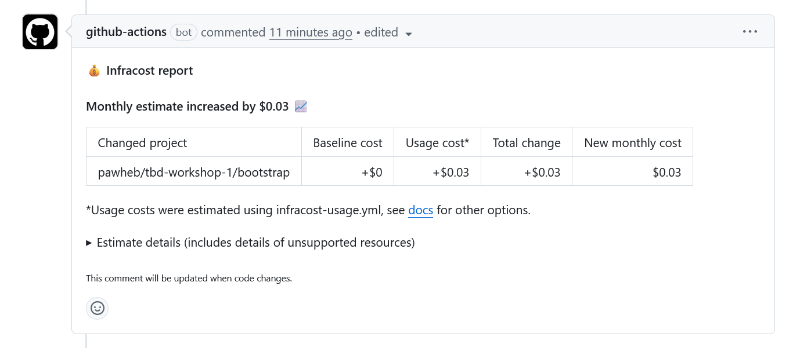
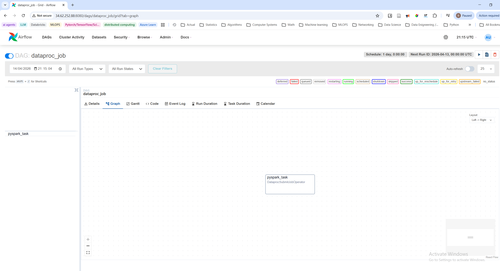
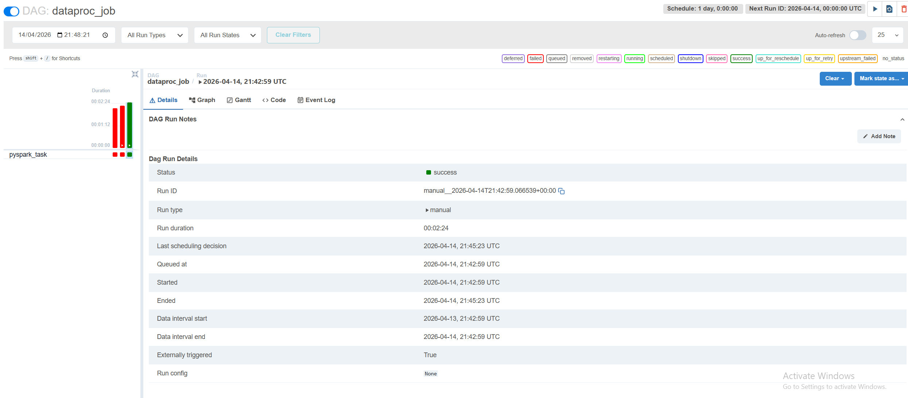
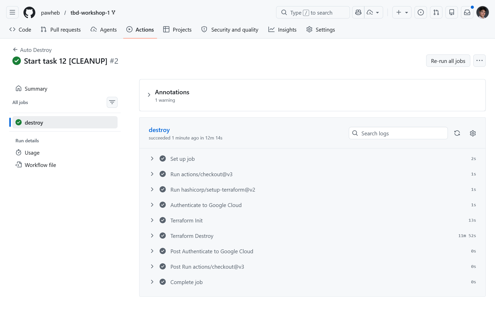

IMPORTANT ❗ ❗ ❗ Please remember to destroy all the resources after each work session. You can recreate infrastructure by creating new PR and merging it to master.


                                                                                                                                                                                                                                                                                                                                                                                  
## Phase 1 Exercise Overview

  ```mermaid
  flowchart TD
      A[🔧 Step 0: Fork repository] --> B[🔧 Step 1: Environment variables\nexport TF_VAR_*]
      B --> C[🔧 Step 2: Bootstrap\nterraform init/apply\n→ GCP project + state bucket]
      C --> D[🔧 Step 3: Quota increase\nCPUS_ALL_REGIONS ≥ 24]
      D --> E[🔧 Step 4: CI/CD Bootstrap\nWorkload Identity Federation\n→ keyless auth GH→GCP]
      E --> F[🔧 Step 5: GitHub Secrets\nGCP_WORKLOAD_IDENTITY_*\nINFRACOST_API_KEY]
      F --> G[🔧 Step 6: pre-commit install]
      G --> H[🔧 Step 7: Push + PR + Merge\n→ release workflow\n→ terraform apply]

      H --> I{Infrastructure\nrunning on GCP}

      I --> J[📋 Task 3: Destroy\nGitHub Actions → workflow_dispatch]
      I --> K[📋 Task 4: New branch\nModify tasks-phase1.md\nPR → merge → new release]
      I --> L[📋 Task 5: Analyze Terraform\nterraform plan/graph\nDescribe selected module]
      I --> M[📋 Task 6: YARN UI\ngcloud compute ssh\nIAP tunnel → port 8088]
      I --> N[📋 Task 7: Architecture diagram\nService accounts + buckets]
      I --> O[📋 Task 8: Infracost\nUsage profiles for\nartifact_registry + storage_bucket]
      I --> P[📋 Task 9: Spark job fix\nAirflow UI → DAG → debug\nFix spark-job.py]
      I --> Q[📋 Task 10: BigQuery\nDataset + external table\non ORC files]
      I --> R[📋 Task 11: Spot instances\npreemptible_worker_config\nin Dataproc module]
      I --> S[📋 Task 12: Auto-destroy\nNew GH Actions workflow\nschedule + cleanup tag]

      style A fill:#4a9eff,color:#fff
      style B fill:#4a9eff,color:#fff
      style C fill:#4a9eff,color:#fff
      style D fill:#ff9f43,color:#fff
      style E fill:#4a9eff,color:#fff
      style F fill:#ff9f43,color:#fff
      style G fill:#4a9eff,color:#fff
      style H fill:#4a9eff,color:#fff
      style I fill:#2ed573,color:#fff
      style J fill:#a55eea,color:#fff
      style K fill:#a55eea,color:#fff
      style L fill:#a55eea,color:#fff
      style M fill:#a55eea,color:#fff
      style N fill:#a55eea,color:#fff
      style O fill:#a55eea,color:#fff
      style P fill:#a55eea,color:#fff
      style Q fill:#a55eea,color:#fff
      style R fill:#a55eea,color:#fff
      style S fill:#a55eea,color:#fff
```

  Legend

  - 🔵 Blue — setup steps (one-time configuration)
  - 🟠 Orange — manual steps (GCP Console / GitHub UI)
  - 🟢 Green — infrastructure ready
  - 🟣 Purple — tasks to complete and document in tasks-phase1.md

1. Authors:

   Group nr. 9

   https://github.com/pawheb/tbd-workshop-1

2. Follow all steps in README.md.

3. From available Github Actions select and run destroy on master branch.

4. Create new git branch and:
    1. Modify tasks-phase1.md file.

    2. Create PR from this branch to **YOUR** master and merge it to make new release.

    

5. Analyze terraform code. Play with terraform plan, terraform graph to investigate different modules.
    ***describe one selected module and put the output of terraform graph for this module here***
    
    The module dataproc creates the Dataproc cluster used for distributed Spark processing. 
    It enables the Dataproc API, creates a dedicated Dataproc service account, creates temporary 
    and staging GCS buckets, and grants the service account IAM permissions for Dataproc worker operation, 
    BigQuery access, and access to the buckets. The module also requires an existing subnet, so it depends on the networking layer.

    Graph for dataproc module

    digraph DataprocModule {
    rankdir=LR;
    node [shape=box];
    
    "google_project_service.dataproc";
    "google_service_account.dataproc_sa";
    "google_storage_bucket.dataproc_staging";
    "google_storage_bucket.dataproc_temp";
    "google_storage_bucket_iam_member.staging_bucket_iam";
    "google_storage_bucket_iam_member.temp_bucket_iam";
    "google_project_iam_member.dataproc_worker";
    "google_project_iam_member.dataproc_bigquery_user";
    "google_project_iam_member.dataproc_bigquery_data_editor";
    "google_dataproc_cluster.tbd-dataproc-cluster";
    
    "google_project_iam_member.dataproc_worker" -> "google_service_account.dataproc_sa";
    "google_project_iam_member.dataproc_bigquery_user" -> "google_service_account.dataproc_sa";
    "google_project_iam_member.dataproc_bigquery_data_editor" -> "google_service_account.dataproc_sa";
    
    "google_storage_bucket_iam_member.staging_bucket_iam" -> "google_service_account.dataproc_sa";
    "google_storage_bucket_iam_member.staging_bucket_iam" -> "google_storage_bucket.dataproc_staging";
    
    "google_storage_bucket_iam_member.temp_bucket_iam" -> "google_service_account.dataproc_sa";
    "google_storage_bucket_iam_member.temp_bucket_iam" -> "google_storage_bucket.dataproc_temp";
    
    "google_dataproc_cluster.tbd-dataproc-cluster" -> "google_project_service.dataproc";
    "google_dataproc_cluster.tbd-dataproc-cluster" -> "google_project_iam_member.dataproc_worker";
    "google_dataproc_cluster.tbd-dataproc-cluster" -> "google_project_iam_member.dataproc_bigquery_user";
    "google_dataproc_cluster.tbd-dataproc-cluster" -> "google_project_iam_member.dataproc_bigquery_data_editor";
    "google_dataproc_cluster.tbd-dataproc-cluster" -> "google_storage_bucket_iam_member.staging_bucket_iam";
    "google_dataproc_cluster.tbd-dataproc-cluster" -> "google_storage_bucket_iam_member.temp_bucket_iam";
    }
    
    Whole graph:
    
    
    Graph for dataproc module:
    

6. Reach YARN UI

   ***place the command you used for setting up the tunnel, the port and the screenshot of YARN UI here***
    
**command:**
    gcloud compute ssh tbd-cluster-m --zone=europe-west1-b --project=tbd-2026l-347310 --tunnel-through-iap --ssh-flag="-L 8088:localhost:8088"

**port:**
    8088

**screenshot**
    

   Hint: the Dataproc cluster has `internal_ip_only = true`, so you need to use an IAP tunnel.
   See: `gcloud compute ssh` with `-- -L <local_port>:localhost:<remote_port>` and `--tunnel-through-iap` flag.
   YARN ResourceManager UI runs on port **8088**.

7. Draw an architecture diagram (e.g. in draw.io) that includes:
    1. Description of the components of service accounts
    2. List of buckets for disposal

    ***place your diagram here***

    

8. Create a new PR and add costs by entering the expected consumption into Infracost
For all the resources of type: `google_artifact_registry_repository`, `google_storage_bucket`
create a sample usage profiles and add it to the Infracost task in CI/CD pipeline. Usage file [example](https://github.com/infracost/infracost/blob/master/infracost-usage-example.yml)
```
  google_storage_bucket.tbd-state-bucket:
    storage_gb: 1
    monthly_class_a_operations: 1000
    monthly_class_b_operations: 5000
    monthly_data_retrieval_gb: 0.1
    monthly_egress_gb: 0.1

  google_storage_bucket.tbd-code-bucket:
    storage_gb: 2
    monthly_class_a_operations: 5000
    monthly_class_b_operations: 20000
    monthly_data_retrieval_gb: 1
    monthly_egress_gb: 1

  google_storage_bucket.tbd-data-bucket:
    storage_gb: 20
    monthly_class_a_operations: 10000
    monthly_class_b_operations: 50000
    monthly_data_retrieval_gb: 5
    monthly_egress_gb: 5

  google_storage_bucket.notebook-conf-bucket:
    storage_gb: 1
    monthly_class_a_operations: 1000
    monthly_class_b_operations: 5000
    monthly_data_retrieval_gb: 0.5
    monthly_egress_gb: 0.5

  google_storage_bucket.mlflow_artifacts_bucket:
    storage_gb: 10
    monthly_class_a_operations: 10000
    monthly_class_b_operations: 50000
    monthly_data_retrieval_gb: 2
    monthly_egress_gb: 2

  google_storage_bucket.dataproc_staging:
    storage_gb: 5
    monthly_class_a_operations: 5000
    monthly_class_b_operations: 20000
    monthly_data_retrieval_gb: 2
    monthly_egress_gb: 2

  google_storage_bucket.dataproc_temp:
    storage_gb: 5
    monthly_class_a_operations: 5000
    monthly_class_b_operations: 20000
    monthly_data_retrieval_gb: 2
    monthly_egress_gb: 2

  google_artifact_registry_repository.registry:
    # Conservative “workshop-scale” assumptions
    storage_gb: 5
    monthly_egress_gb: 10
```
  
    
9. Find and correct the error in spark-job.py

    After `terraform apply` completes, connect to the Airflow cluster:
    ```bash
    gcloud container clusters get-credentials airflow-cluster --zone europe-west1-b --project PROJECT_NAME
    ```
    
    Then check the external IP (AIRFLOW_EXTERNAL_IP) of the webserver service:
    kubectl get svc -n airflow airflow-webserver                                                                                                                                                                 
                                              
                                                                                                                                                                                                               
    ▎ Note: If EXTERNAL-IP shows <pending>, wait a moment and retry — LoadBalancer IP allocation may take 1-2 minutes.  

    DAG files are synced automatically from your GitHub repo via git-sync sidecar.
    Airflow variables and the `google_cloud_default` GCP connection are also configured by Terraform.

    a) In the Airflow UI (http://AIRFLOW_EXTERNAL_IP:8080, login: admin/admin), find the `dataproc_job` DAG, unpause it and trigger it manually.

    

    b) The DAG will fail. Examine the task logs in the Airflow UI to find the root cause.

    The relevant part of the log seems to be:

    >state: ERROR
    details: "Google Cloud Dataproc Agent reports job failure. If logs are available, they can be found at:\nhttps://console.cloud.google.com/dataproc/jobs/17d1784c-b972-4519-b41d-6e051cf73370?project=tbd-2026l-3474255&region=europe-west1\ngcloud dataproc jobs wait \'17d1784c-b972-4519-b41d-6e051cf73370\' --region \'europe-west1\' --project \'tbd-2026l-3474255\'\nhttps://console.cloud.google.com/storage/browser/tbd-2026l-3474255-dataproc-staging/google-cloud-dataproc-metainfo/318a37c3-cf3a-4c51-8449-c73556413422/jobs/17d1784c-b972-4519-b41d-6e051cf73370/\ngs://tbd-2026l-3474255-dataproc-staging/google-cloud-dataproc-metainfo/318a37c3-cf3a-4c51-8449-c73556413422/jobs/17d1784c-b972-4519-b41d-6e051cf73370/driveroutput.*"
    state_start_time {
    seconds: 1776201427
    nanos: 167773000
    }

    The error says that a Dataproc (spark) job failed running. When looking at the DAG code I can see it triggers a Dataproc (spark) job. So I scanned the failure logs for things related to that.

    Then in the Dataproc job logs I can see the actuall error

    >File "/tmp/17d1784c-b972-4519-b41d-6e051cf73370/spark-job.py", line 42, in <module>
    df.write.mode("overwrite").orc(DATA_BUCKET)
    "message": "The specified bucket does not exist.",

    So it writes to a bucket which doses not exist.


    c) Fix the error in `modules/data-pipeline/resources/spark-job.py` and re-upload the file to GCS:
    ```bash
    gsutil cp modules/data-pipeline/resources/spark-job.py gs://PROJECT_NAME-code/spark-job.py
    ```
    Then trigger the DAG again from the Airflow UI.

    URL to fixed file: https://storage.cloud.google.com/tbd-2026l-3474255-code/spark-job.py

    d) Verify the DAG completes successfully and check that ORC files were written to the data bucket:
    ```bash
    gsutil ls gs://PROJECT_NAME-data/data/shakespeare/
    ```
    

11. Create a BigQuery dataset and an external table using SQL

    Using the ORC data produced by the Spark job in task 9, create a BigQuery dataset and an external table.

    Note: the dataset must be created in the same region as the GCS bucket (`europe-west1`), e.g.:
    ```bash
    bq mk --dataset --location=europe-west1 shakespeare
    ```

    External table creation SQL:
    ```SQL
    CREATE OR REPLACE EXTERNAL TABLE `shakespeare.wordcount_orc`
    OPTIONS (
    format = 'ORC',
    uris = ['gs://tbd-2026l-3474255-data/data/shakespeare/*']
    );
    ```
    Dataset Query result:
    ```
    1	dearest	56
    2	Only	56
    3	kneel	56
    4	mend	56
    5	below	56
    6	kindness56
    7	lover	56
    8	despair	56
    9	DIANA	56
    10	Hostess	56	
    ```

    ***why does ORC not require a table schema?***
    
    As per the ORC Apache docs:

    >ORC files are completely self-describing and do not depend on the Hive Metastore or any other external metadata. The file includes all of the type and encoding information for the objects stored in the file. Because the file is self-contained, it does not depend on the user’s environment to correctly interpret the file’s contents.

12. Add support for preemptible/spot instances in a Dataproc cluster

    Here is the addded TF code

    ```Bash
    preemptible_worker_config {
      num_instances = 1

      disk_config {
        boot_disk_type    = "pd-standard"
        boot_disk_size_gb = 500
      }
    }
    ```
    link to the changed file: https://github.com/BrunoKedzierski/tbd-workshop-1/blob/master/modules/dataproc/main.tf

13. Triggered Terraform Destroy on Schedule or After PR Merge. Goal: make sure we never forget to clean up resources and burn money.

Add a new GitHub Actions workflow that:
  1. runs terraform destroy -auto-approve
  2. triggers automatically:

   a) on a fixed schedule (e.g. every day at 20:00 UTC)

   b) when a PR is merged to master containing [CLEANUP] tag in title

Steps:
  1. Create file .github/workflows/auto-destroy.yml
  2. Configure it to authenticate and destroy Terraform resources
  3. Test the trigger (schedule or cleanup-tagged PR)

Hint: use the existing `.github/workflows/destroy.yml` as a starting point.

`auto-destroy.yml`
```
name: Auto Destroy

on:
  schedule:
    # Every day at 20:00 UTC
    - cron: "0 20 * * *"

  pull_request:
    types: [closed]
    branches: [master]

permissions: read-all

jobs:
  destroy:
    # Only run when:
    # - scheduled event, OR
    # - PR was merged AND the PR title contains "[CLEANUP]"
    if: >
      github.event_name == 'schedule' ||
      (github.event.pull_request.merged == true && contains(github.event.pull_request.title, '[CLEANUP]'))

    runs-on: ubuntu-latest

    # Must allow OIDC auth to GCP
    permissions:
      contents: write
      id-token: write
      pull-requests: write
      issues: write

    steps:
      - uses: actions/checkout@v3

      - uses: hashicorp/setup-terraform@v2
        with:
          terraform_version: 1.11.0

      - id: auth
        name: Authenticate to Google Cloud
        uses: google-github-actions/auth@v1
        with:
          token_format: access_token
          workload_identity_provider: ${{ secrets.GCP_WORKLOAD_IDENTITY_PROVIDER_NAME }}
          service_account: ${{ secrets.GCP_WORKLOAD_IDENTITY_SA_EMAIL }}

      - name: Terraform Init
        run: terraform init -backend-config=env/backend.tfvars

      - name: Terraform Destroy
        run: terraform destroy -no-color -var-file env/project.tfvars -auto-approve
        continue-on-error: false
```



Scheduling cleanup ensures cloud resources are automatically destroyed even if someone forgets to run terraform destroy manually through the github action, preventing unnecessary GCP costs between workshop sessions.
